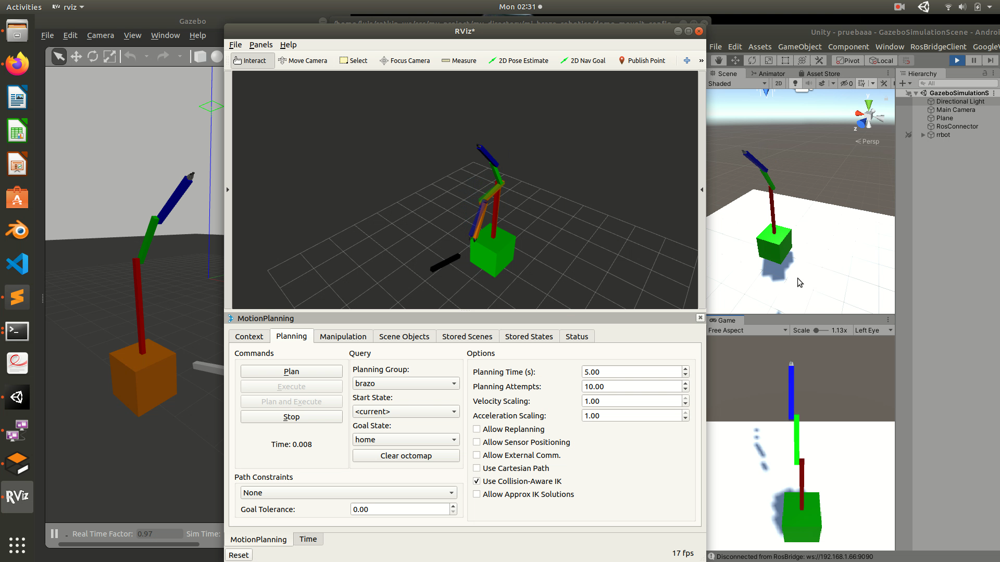

# Digital-Twin-Teleoperation

Teleoperation and supervision are some examples that can be made using digital twin. 
This repository containes all packages for ROS Gazebo and Moveit to control a robot arm RRR.

# Youtube

https://www.youtube.com/watch?v=XWAzReoH-Bs&feature=youtu.be
